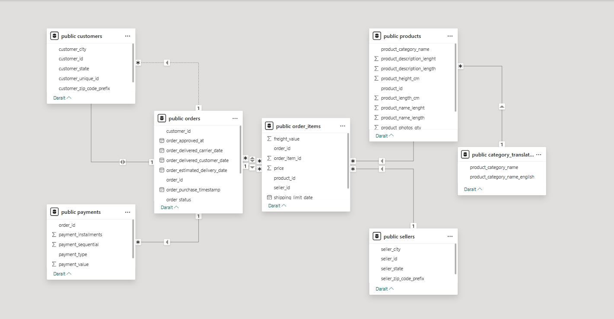
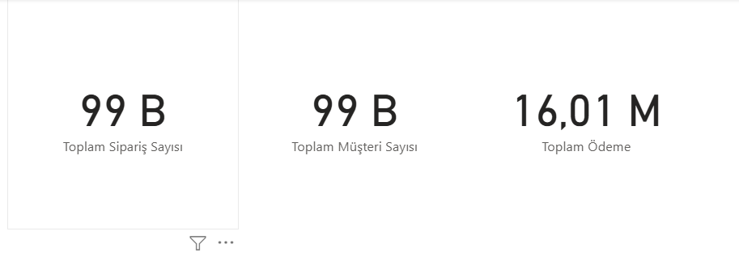
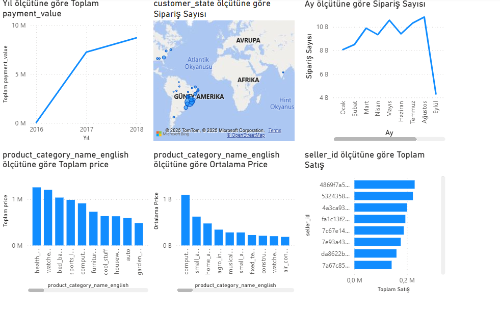

# 📊 Olist E-Ticaret Analizi - Power BI Projesi

Bu proje, KızBaşına Veri Analizi Bootcamp kapsamında gerçekleştirilmiş olup Brezilya merkezli e-ticaret platformu **Olist**'in verileri kullanılarak Power BI ile görselleştirme ve analiz yapılmıştır.

## 🧠 Projenin Amacı

Proje kapsamında, Olist'in operasyonel verileri üzerinden:
- Temel performans göstergelerinin (KPI) oluşturulması
- Ürün, kategori, müşteri, satıcı ve zaman boyutlarında analizlerin yapılması
- Harita ve zaman serisi görselleriyle veri içgörülerinin ortaya konulması hedeflenmiştir.

---

## 🗂️ Kullanılan Veritabanı Tabloları

- `orders`
- `order_items`
- `customers`
- `products`
- `sellers`
- `payments`
- `product_category_name_translation`

---

## 🔗 Veri Modeli ve İlişkiler

Aşağıdaki ilişkiler kurulmuştur:

- `orders.customer_id` → `customers.customer_id`  
- `orders.order_id` → `order_items.order_id`  
- `order_items.product_id` → `products.product_id`  
- `order_items.seller_id` → `sellers.seller_id`  
- `orders.order_id` → `payments.order_id`  
- `products.product_category_name` → `category_translation.product_category_name`

📷 **Veri modeli ekran görüntüsü:**  

---

## 📌 KPI Kartları

- Toplam Sipariş Sayısı  
- Toplam Müşteri Sayısı  
- Toplam Ödeme Tutarı

📷 **KPI ekranı:**  

---

## 📈 Görselleştirmeler

### 1. Yıllara Göre Ödeme Tutarı
- `order_purchase_timestamp` üzerinden yıllık toplam `payment_value` çizgi grafiği

### 2. Aylık Sipariş Dağılımı
- Siparişlerin ay bazlı zaman serisi analizi

### 3. Harita Görselleştirmesi
- `customer_state` konumlarına göre sipariş yoğunluğu

### 4. Kategoriye Göre Satış ve Ortalama Fiyat
- En çok satış yapılan ürün kategorileri
- Kategori bazlı ortalama ürün fiyatı

### 5. En Çok Satış Yapan Satıcılar
- `seller_id` bazlı satış tutarı

### 6. Sipariş Statüsü Dağılımı
- `order_status` sütununa göre sipariş durumu analizi

📷 **Grafikler ekran görüntüsü:**  

---

## 🛠️ Kullanılan Teknolojiler

- PostgreSQL (Veri Yükleme ve SQL)
- Power BI (Veri modelleme ve görselleştirme)
- DAX (Ölçü hesaplamaları için)

---

## 🎥 Proje Videosu

▶️ [Proje sunum videosunu izlemek için buraya tıklayın](https://www.loom.com/share/20979e49e95f4f1aae4a99ef27ccfaab?sid=0902a835-89eb-4961-896e-debd03f3967b)

---

## 👤 Hazırlayan

**[Efsa Tortuk]**  
📧 [efsatortuk@gmail.com]  

---

## 🚀 Projeyi Çalıştırmak İçin

> Eğer Power BI dosyasını incelemek isterseniz:
1. PostgreSQL kurulmalı
2. Olist veritabanı ve tablolar import edilmeli
3. `.pbix` dosyası Power BI Desktop ile açılmalı

---

